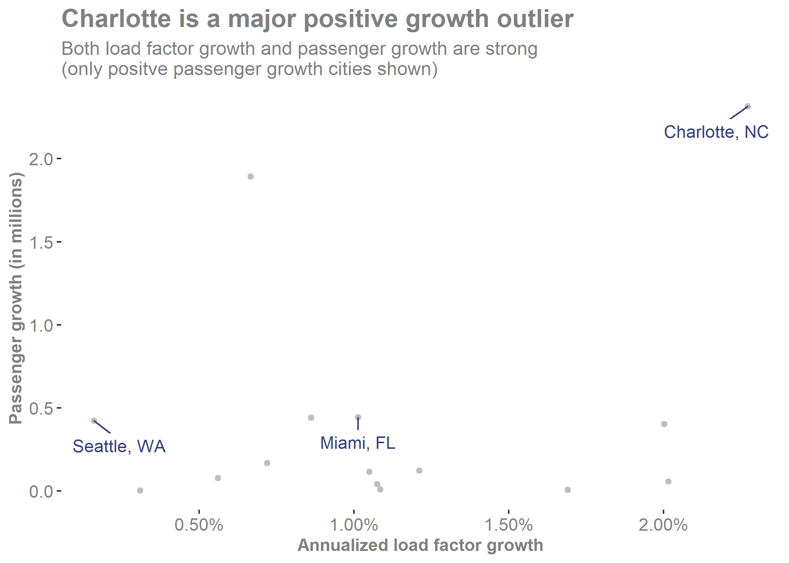

#### **To:** American Airlines
  
#### **From:** Eric Hestekin
  
#### **Date:** 03/19/2009

#### **RE:** Insights into Growth Strategies During Aviation Market Downturn 

***

```{r include = FALSE}
# Set chunk options for the file
knitr::opts_chunk$set(echo = FALSE, message = FALSE, warning = FALSE)

```

```{r include = FALSE}
# Course: 5210 Communicating Data
# Purpose: Communicate findings of Flight Growth Analysis
# Date: 3/19/2020
# Author: Eric Hestekin

```

```{r include = FALSE}
# Clear environment of variables and functions
rm(list = ls(all = TRUE)) 

# Clear environmet of packages
if(is.null(sessionInfo()$otherPkgs) == FALSE)lapply(paste("package:", names(sessionInfo()$otherPkgs), sep=""), detach, character.only = TRUE, unload = TRUE)

```


The American aviation industry is currently experiencing a major downturn.  Since passenger volume peaked in 2007, it has fallen almost 10% in the previous two years.  This is a challenging time for this industry.  The strategy decisions made at this time are extremely important due to the the market challenges presented to us.  For this analysis, I used recent domestic flight data to determine the best near-term growth strategy for American Airlines.  A high-level summary of the findings:

- Three of the current American Airlines hubs, Charlotte, Dallas, and Miami should be expanded with **Charlotte being the top priority**  
- Increase seats offered in another growing city, Seattle

**Finding #1: Cities with growing populations need growing flight options**

This finding may seem intuitve, however the fastest growing city in America and one of the hubs, Dallas, TX has not seen its flight offerings increased.  I looked into the relationship between population growth and passenger growth and found a strong correlation.  Dallas has increased its population by more than a million people in the last five years but the seats offered out of Dallas have been relatively flat.  As one of American Airlines' existing hubs, there is a prime opportunity to tap into the larger Dallas population and increase the flights offered for them.  Due to the strong correlation bewteen population increases and passengers flown, I am confident it would be a successful expansion.  


Another one of the exisiting hubs, Charlotte, NC, has seen the most impressive flight growth in the past five years.  This is certainly due in part to American Airlines' focus at the airport and the efforts should be recognized.  However given the market challenges, the focus on Charlotte needs to remain.


{width=700px}

**Finding #2: Cities with high load factors have positive growth trends**

Being in the airline industry, you know that empty seats waste money and eat into profits.  This is why I focused on growing cities with already high load factors as an area for expansion.  Routes with high load factors are more profitable and furthermore, my analysis found a strong correlation between load factor and future passenger growth.  This is an important finding because it implies a lower risk of loss when expanding.  Combining a high load factor with the first finding regarding growing cities, I found two additional cities which should be focused on for growth:  Seattle and Miami.  These cities along with the aforementioned Dallas and Charlotte, all are growing cities where there is a large percentage of seats already being filled.  This is the perfect combination for growth.


{width=700px}

**Conclusion**

In summary, I found growing city population and high load factors to be good predictors of passenger growth.  The overall market might be declining which could be cause for concern, but focusing on my growth recommendations will allow the company to succeed despite the market conditions.  The four cities with the most promise based on these two factors along with American Airlines existing opperations are Charlotte, Dallas, Miami, and Seattle.

All of the accompanying work can be found in the technical appendix. If you have additional questions, you can contact me at ehestekin@seattleu.edu.

Thank you.

