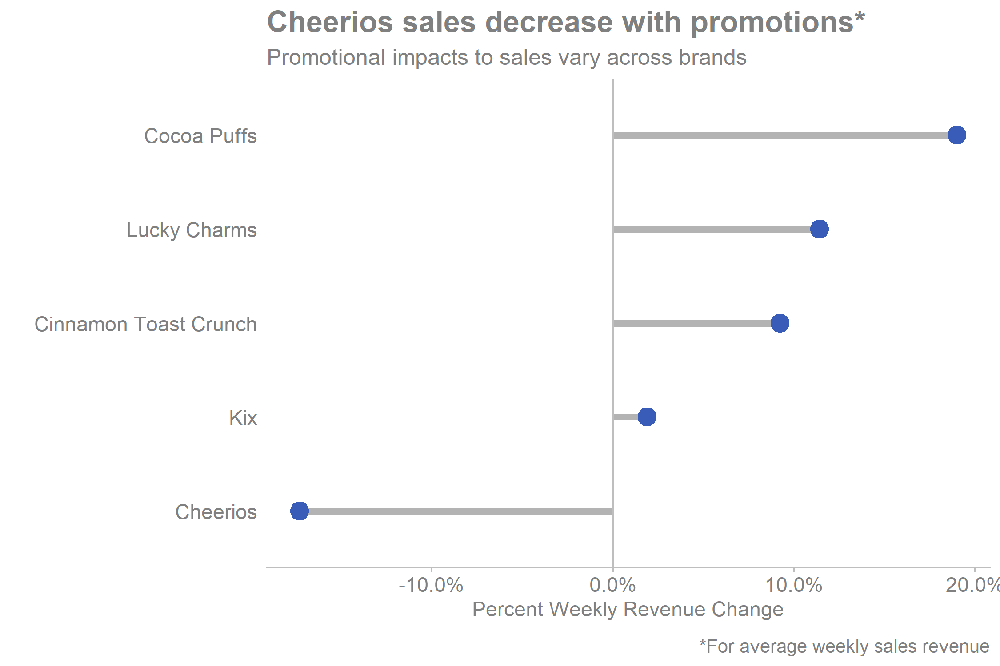

#### **To:** Quian Xu
  
#### **From:** Eric Hestekin and Schyuler Lujan 
  
#### **Date:** 02/13/2020

#### **RE:** Insights Regarding General Mills Promotions Sales Strategy 

***

```{r include = FALSE}
# Set chunk options for the file
knitr::opts_chunk$set(echo = FALSE, message = FALSE, warning = FALSE)

```

```{r include = FALSE}
# Course: 5210 Communicating Data
# Purpose: Illustrate how to make a html memo and import a saved project visual
# Date: Aug 5, 2019
# Author: Gareth Green

```

```{r include = FALSE}
# Clear environment of variables and functions
rm(list = ls(all = TRUE)) 

# Clear environmet of packages
if(is.null(sessionInfo()$otherPkgs) == FALSE)lapply(paste("package:", names(sessionInfo()$otherPkgs), sep=""), detach, character.only = TRUE, unload = TRUE)

```

```{r}
#Load libraries
library(tidyverse)

#Load full_df from TA
df <- read.csv("full_df.csv")

fig1 <- df %>% 
  filter(company == "General Mills") %>% 
  group_by(brand, promo) %>% 
  summarise(avg_sales = mean(total_sales)) %>% 
  pivot_wider(names_from = promo, values_from = avg_sales) %>% 
  rename("no_promo" = "0", "promo" = "1") %>% 
  mutate(difference = promo - no_promo,
         pdifference = (promo - no_promo)/promo)
```

General Mills is interested in how their brands are performing relative to the competition. There's also interest in understanding the effectiveness of the promotional strategy. For this analysis, we are using a representative sample of weekly sales data containing `r dim(df)[1]` observations. The goal of our analysis is to 1) assess the effectiveness of promotions on sales of General Mill products and 2) determine the company's competitiveness with other brands. A high-level summary of our findings is as follows:

- Discounts are larger for General Mills products when compared to their competitors' discounts
- Promotions negatively impact average weekly sales for Cheerios

**Finding #1: Discounts are larger than the competition**

Initially, we explored the effect of promotions on sales volume and revenue. We discovered that Kellogg's is the only company that increases both its sales revenue and sales volume when running promotions. When looking at differences between promotional sales for Kellogg's and General Mills, we discovered that Kellogg's average price discounts are smaller. Furthermore, Kellogg's promotional prices are also smaller. Therefore, it's possible for General Mills to shrink its discounts, resulting in higher revenue.


{width=700px}

**Finding #2: Promotions hurt Cheerios sales**

When assessing the impact of promotions on sales revenue, we discovered differences between brands. Although Cheerios has the highest total sales of all General Mills brands, it performs the worst with promotions. On average, weekly sales for Cheerios decrease by 17% when running promotions. In contrast, Kellogg's does not have a single brand that decreases in sales with promotions, and they show an increase in sales across most brands. Therefore, the promotion strategy for Cheerios should be revisited due to its negative impact on the largest revenue-producing brand.


{width=700px}

**Conclusion**

In summary, we found that General Mills discounts are larger than Kellogg's, the best-performing competitor. Overall, General Mills may be providing too much of a discount which is causing a decrease in revenues. Additionally, we found that promotions negatively impact Cheerios sales. Within General Mills, Cheerios has the smallest discounts but the worse sales performance with promotions. 

Therefore, our recommendation is that promotional discounts need to be shrunk overall. However, modifying Cheerios discounts to be comparable to other General Mills brands may create sales gains similar to those brands. 

All our accompanying work can be found in the technical appendix. If you have additional questions, you can contact Eric at ehestekin@seattleu.edu and Schyuler at lujans@seattleu.edu.

