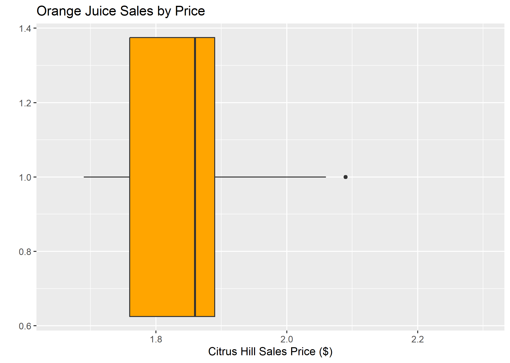

***

``` {R include = FALSE}
#Set chunk options for this file
knitr::opts_chunk$set(echo = FALSE, message = FALSE, warning = FALSE)

```

``` {R}
# Course: 5210 Communicating Data
# Week 2 Assignment, creating a memo in markdown
# Date: 1/14/2019
# Author: Eric Hestekin

```

```{r}
# Clear environment of variables and functions
rm(list = ls(all = TRUE)) 

# Clear environmet of packages
if(is.null(sessionInfo()$otherPkgs) == FALSE)lapply(paste("package:", names(sessionInfo()$otherPkgs), sep=""), detach, character.only = TRUE, unload = TRUE)

```

``` {R}

#not using any libraries in the memo itself so no need to load any libs

```

I was provided with orange juice sales data for 1070 orange juice purchases.  The data contained pricing and sales data for two different brands of orange juice, Minute Made and Citrus Hill.  This analysis was performed to determine the affect of price on sales of orange juice.

``` {R}
#Note could use R data directly in this memo (like example) but taking numbers manually from notebook/tech apendix instead to avoid duplicate work
```
The analysis found that 61% of the orange juice sales were for Citrus Hill.  Citrus Hill had a median price $0.23 (`r round(0.23 / 2.09 * 100 , 2)`%) lower than Minute Maid.  The plot below shows the price distribution of the Citrus Hill sales prices:



Note the larger variation in price in the 2nd quartile compared to the 3rd quartile.

The analysis implies that price is a significant factor in determining orange juice sales.  Further analysis is required to determine other factors.

Best,
Eric Hestekin