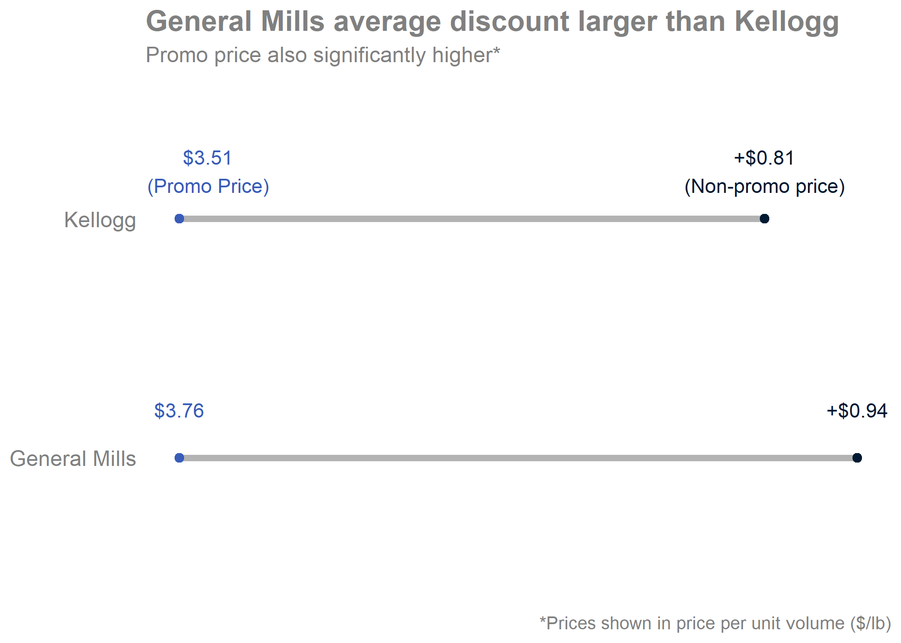

```{r setup, include=FALSE}
library(flexdashboard)
library(tidyverse)
library(gridExtra)
#DT for datatable objects
library(DT)
library(patchwork)
```

Midterm project final plots {data-width=650}
-----------------------------------------------------------------------

### Promo price dumbbell plot



### Promo price affect on brand sales


Plots in R Code 
-----------------------------------------------------------------------
```{r}
full_df <- read.csv('full_df.csv')
```


### Test putting patchwork plot in dashboard window

```{r}
#just doing summary was ugly
#summary(full_df)

#try table grob (also didnt work)
# tableGrob(summary(full_df))

#this didn't quite work either
#datatable(summary(full_df))


### Try arranged plot in lower window


#interested in price/volume between promo and no promo for each company
# grid.arrange(
#   full_df[full_df$promo == 0,] %>% 
#     ggplot(mapping = aes(x = volume * units, y = total_sales, color = company)) +
#     geom_smooth() +
#     scale_x_continuous('Total Volume', limits = c(0,80)) +
#     scale_y_continuous('Total Sales', limits = c(0, 125)),
#   
#   full_df[full_df$promo == 1,] %>% 
#     ggplot(mapping = aes(x = volume * units, y = total_sales, color = company)) +
#     geom_smooth() +
#     scale_x_continuous('Total Volume',limits = c(0,80)) +
#     scale_y_continuous('Total Sales', limits = c(0, 125)),
#   
#   ncol = 1
# )

#Note above code worked for plot but trying to get table to work better
# Use patchwork to get tableGrob working
p1 <- full_df[full_df$promo == 0,] %>% 
    ggplot(mapping = aes(x = volume * units, y = total_sales,
                         color = company)) +
    geom_smooth() +
    scale_x_continuous('Total Volume', limits = c(0,80)) +
    scale_y_continuous('Total Sales', limits = c(0, 125))

p2 <- full_df[full_df$promo == 1,] %>%
    ggplot(mapping = aes(x = volume * units, y = total_sales,
                         color = company)) +
    geom_smooth() +
    scale_x_continuous('Total Volume',limits = c(0,80)) +
    scale_y_continuous('Total Sales', limits = c(0, 125))

(p1 / p2) #| tableGrob(summary(full_df[,c('total_sales','volume','units')]))
```


### Gave up on putting summary table in
Add in cool bar plot from GM promos analysis

How do I control this layout better?

Note words covered up

and plot cramped horizontally

```{r}
z <- qnorm(0.975)

full_df %>% 
  filter(company == "General Mills") %>% 
  mutate(total_volume = units * volume) %>% 
  group_by(company, brand, promo) %>% 
  summarize(avg_vol = mean(total_volume), avg_sales = mean(total_sales),
            n = n(), sd_vol = sd(total_volume), sd_sales = sd(total_sales),
            ci_vol = z * sd_vol/sqrt(n), ci_sales = z * sd_sales/sqrt(n)) %>% 
  ggplot(mapping = aes(x = brand, y = avg_vol, fill = as.factor(promo))) +
  geom_bar(stat = 'identity', position = 'dodge') +
  coord_flip() +
  labs(title = "Average total volume for General Mills brands") +
  geom_errorbar(aes(ymin = avg_vol - ci_vol, ymax = avg_vol + ci_vol),
                width = 0.75, position = position_dodge(0.9))
```


