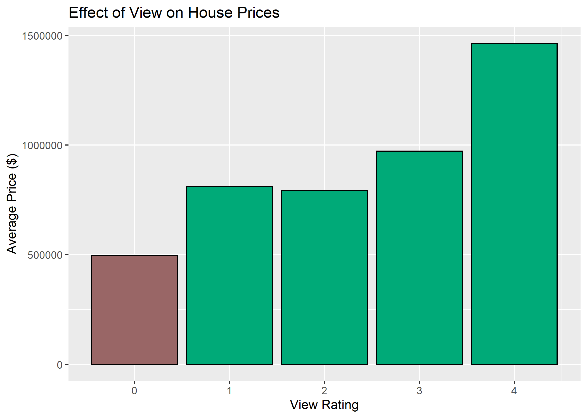

For this study, the housing sale data from King County was analyzed.  The goal of the study was to discover insights into what drives housing prices and sales in the county.  This market analysis is important for the company as it can be useful data to the customer and help create customer loyalty through higher quality data than the competitors.  This memo presents two observations of the market, however there are certainly more analysis that could be done.  Many preliminary data exploration was done and can be seen in the technical appendix.

### Observation 1

The first major observation from the market data is how valuable a view is in King County.  The dataset has a view rating which rates the view of a property from 0 - 4, with 0 being no view.  In this dataset, 90% of the homes had a view rating of 0.  However, the houses with a view were on average much more valuable.

As the above plot shows, going from no view to a modest view increases the average value by over 50%.  This is significant when designing a new home as adding a view can result in a large increase in value.

### Observation 2

The second observation from the market data is how valuable a renovation can be and similarly how important condition of the house is at time of sale.  It was found that for every year newer a renovation is, the price per square foot of the home increases by close to one dollar.  This implies a home with a brand new renovation will be on average worth close to $10/sqft more than a similar house with a ten year old renovation.  This insight could be valuable for customers considering renovating.

Similarly, the condition of the home when it is sold is very important for the value.  This dataset uses a rating from 1-5 for condition with 1 being the lowest.  We found homes with a condition rating of 3-5 are more than 40% more valuable on average than homes with a condition of 1-2.  This is a similar insight into how valuable a renovation can be, especially if it takes a home from a condition rating of 2 to 3.

### Conclusion

In conclusion, the two major takeaways from analyzing the King County home price data are how valuable a view is and how much a renovation can improve the value of a home.  These two findings can be passed on to our customers to provide them valuable data points for them to use when making home purchase/renovation decisions.  There are several more interesting areas of this data that should be investigated further.  The preliminary exploration of these topics are included in the technical appendix.